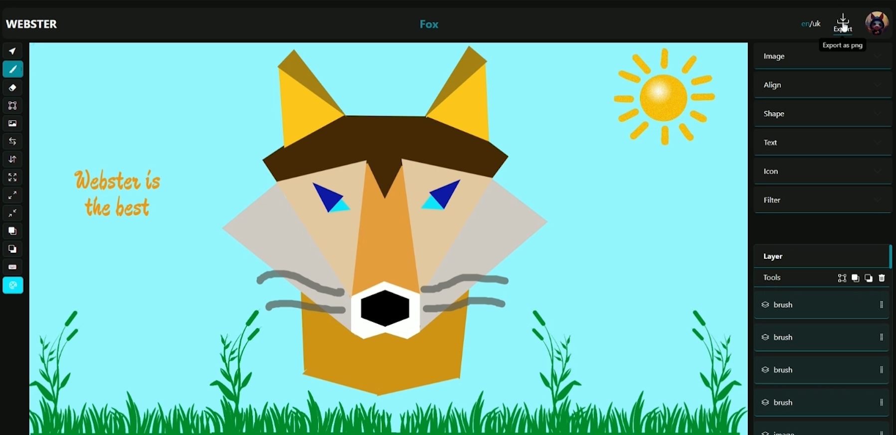
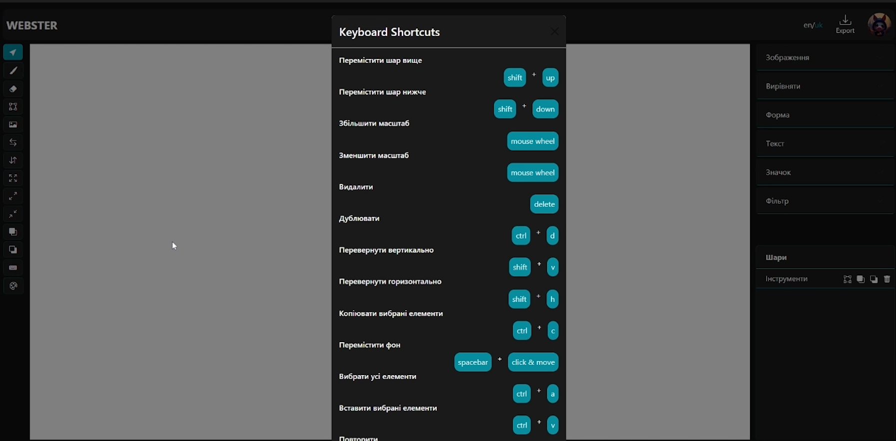
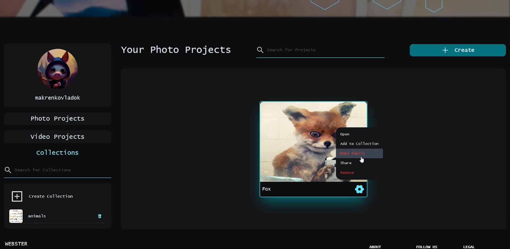
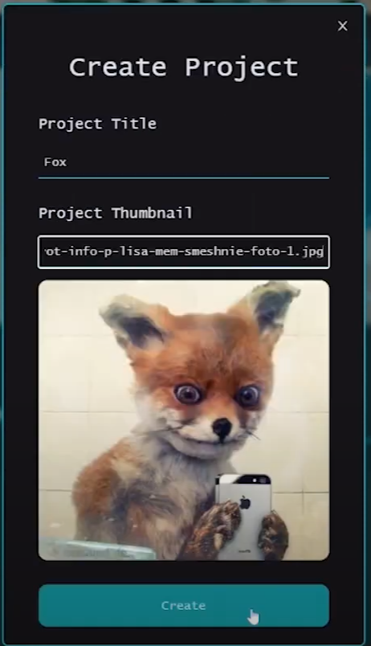
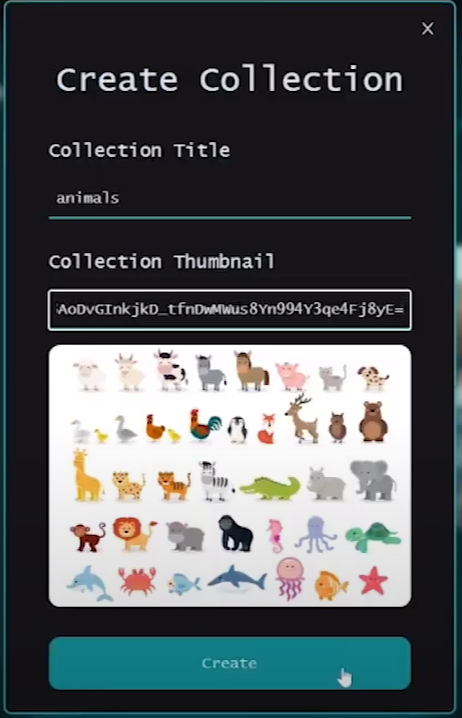

### [📹 Demo Video](https://www.youtube.com/watch?v=6yM8neFi0mQ)

# About

Webster is an online photo editing software that lets you create projects and collaborate seamlessly with friends. With Webster, you can edit images in real time at the same time, making it easy to enhance and transform your photos together. Share your projects with friends, experience the joy of collaborative editing, and bring your creativity to life like never before.

## Tech Stack (PERN)

#### Front-end

- Front-end Framework: `React (with Redux)`
- Editor: `Konva`
- Styling: `Tailwindcss`
- Localization: `i18next`

#### Back-end

- For handling index requests: `Node.js with Express Framework`
- As Database: `PostgreSQL with prisma`
- For collaborative editing: `Socket.io`

## features

### image editor
 - eraser
 - brash
 - scale
 - filters
 - shapes
 - align
 - text
 - icons
 - layers
 - colors
 - shortcuts
 - together editing
 - load image
 - synchronization with a server
 - etc.

#### Editor page

#### Shortcuts

#### Projects page

#### Create project / collection forms

<h2>Contacts</h2>
<h3>vmakarenko</h2>

<h3>yzhuravlov</h2>

<h3>mmazurenko</h2>

<h3>yklymenko</h2>

